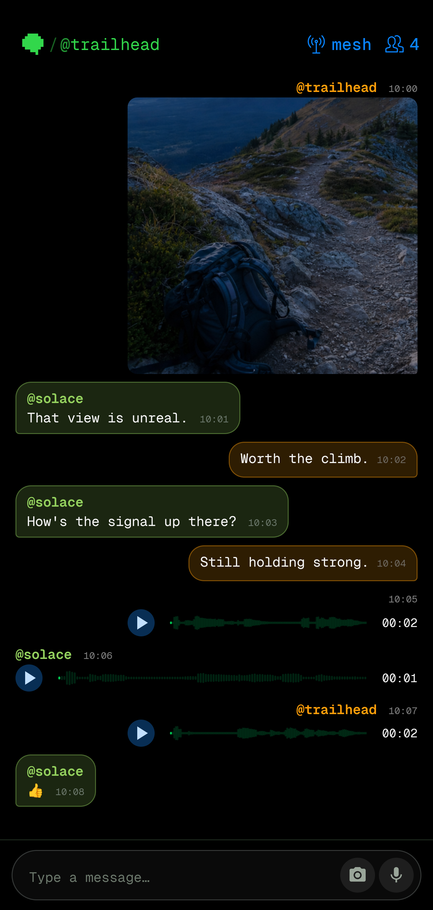
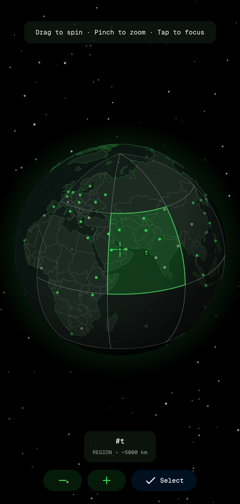

<p align="center">
  
</p>

## MeshTalk for Android

A decentralized peer-to-peer messaging app with dual transport architecture: local Bluetooth mesh networks for offline communication and internet-based Nostr protocol for global reach. No accounts, no phone numbers, no central servers.

MeshTalk is built on [bitchat-android](https://github.com/permissionlesstech/bitchat-android) and stays protocol-compatible with the [bitchat iOS version](https://github.com/permissionlesstech/bitchat) for cross-platform mesh communication.

## See it in action

<table>
  <tr>
    <th>Offline mesh conversation</th>
    <th>Geohash globe picker</th>
  </tr>
  <tr>
    <td></td>
    <td></td>
  </tr>
</table>

## Features

- **Dual Transport Architecture**: Bluetooth LE mesh for offline messaging, Nostr relays for internet-based messaging
- **Location-Based Channels**: Geographic chat rooms using geohash coordinates over Nostr relays
- **Intelligent Message Routing**: Automatically chooses the best transport, with queuing and retry when a peer is unreachable
- **End-to-End Encryption**: [Noise Protocol](https://noiseprotocol.org) (XX pattern, X25519 + ChaCha20-Poly1305) for private messages over the mesh
- **Decentralized Mesh Network**: Automatic peer discovery and multi-hop relay over Bluetooth LE (max 7 hops)
- **Wi-Fi Aware Transport**: Higher-bandwidth local mesh on supported devices
- **Channel Chats**: Topic-based group messaging with optional password protection (Argon2id + AES-256-GCM)
- **IRC-Style Commands**: Familiar `/join`, `/msg`, `/who` style interface
- **Tor Support**: Built-in Tor (Arti) for private internet connectivity
- **Emergency Wipe**: Triple-tap to instantly clear all data
- **Cross-Platform**: Binary protocol compatible with bitchat on iOS and macOS

## Technical Architecture

### Bluetooth Mesh Network (Offline)

- Direct peer-to-peer within Bluetooth range, multi-hop relay through nearby devices
- Noise Protocol sessions with forward secrecy; peer identities derived from static keys
- Compact binary packet format with fragmentation, TTL routing, and deduplication
- Adaptive duty cycling and connection limits for battery efficiency
- Foreground service keeps the mesh alive within Android background execution limits

### Nostr Protocol (Internet)

- Global reach via public relays, geohash-based location channels
- Private messages fall back to Nostr for mutual favorites when the mesh is unavailable
- Ephemeral keys per geohash area

### Android Stack

- Kotlin, Jetpack Compose (Material 3), MVVM
- Coroutines and Flow for all networking and state
- Core components: `MeshForegroundService` (persistent connectivity), `BluetoothMeshService` / `WifiAwareMeshService` (transports), `UnifiedMeshService` (transport selection), `NoiseSessionManager` (encryption sessions), `MessageRouter` (mesh/Nostr routing with outbox retry)

## Building

Requires Android Studio and the Android SDK (API 26+).

```bash
git clone https://github.com/aditya1234u5/MeshTalk-PBL.git
cd MeshTalk-PBL
./gradlew assembleDebug
```

Install on a connected device:

```bash
adb install -r app/build/outputs/apk/debug/app-debug.apk
```

The app requests Bluetooth, location (required for BLE scanning), and notification permissions at runtime.

## Testing

```bash
# Unit tests
./gradlew test

# Lint
./gradlew lint

# Instrumented tests (requires a device or emulator)
./gradlew connectedAndroidTest
```

Note that BLE mesh behavior is difficult to emulate; protocol and session logic is covered by unit tests, while radio-level behavior needs real devices.

## Credits

MeshTalk is based on the open-source [bitchat-android](https://github.com/permissionlesstech/bitchat-android) project.

## License

See the [LICENSE](LICENSE.md) file for details.
